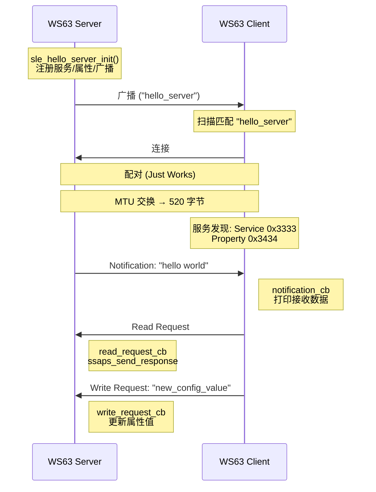
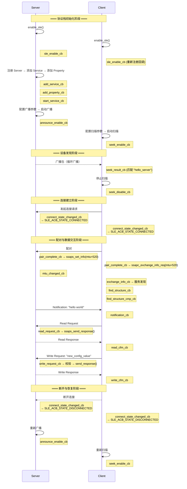

# SLE Hello — 星闪低功耗连接 Hello World

WS63 SLE 基础示例，分 Server / Client 两个可切换构建目标，展示从广播/扫描、连接、配对、服务发现到通知推送与读写交互的完整建链与数据通信过程。本示例是理解其余 SLE 示例的前置教程。


## 功能规格

| 规格项 | Server 端 | Client 端 |
|--------|----------|----------|
| 广播/扫描 | 上电后以 "hello_server" 名称持续广播 | 上电后扫描并匹配 "hello_server" |
| 配对 | 被动等待配对 | 连接成功后主动发起配对 (Just Works) |
| MTU | 配对完成后设置 520 字节 | 配对完成后发起 MTU 交换 |
| 服务发现 | — | 遍历 Server 的 Service / Property / Descriptor |
| 通知推送 | 配对完成后主动发送 "hello world" 通知 | notification_cb 接收并打印 |
| 读取交互 | read_request_cb 返回当前属性值 | 服务发现完成后发起读请求 |
| 写入交互 | write_request_cb 更新属性值 | 读确认后发起写请求 ( "new_config_value" ) |
| 连接管理 | 断开后自动重新广播 | 断开后自动重新扫描 |

## 通信流程

下图展示从两块板子上电到通知、读写交互完成的完整流程：



## SSAP 服务定义

Server 端注册一个服务，包含一个可读、可写、可通知的属性：

| 项目 | 值 | 说明 |
|------|----|------|
| Service UUID | 0x3333 | 16-bit UUID |
| Property UUID | 0x3434 | 16-bit UUID |
| Property 权限 | READ \| WRITE | 可读可写 |
| Operation Indication | READ \| WRITE \| NOTIFY | 支持的交互类型 |
| Descriptor 类型 | USER_DESCRIPTION | 用户描述符 |
| Descriptor 权限 | READ | 仅可读 |

UUID 使用 16-bit 格式，基于标准 128-bit base UUID `{0x37, 0xBE, 0xA8, 0x80, 0xFC, 0x70, 0x11, 0xEA, 0xB7, 0x20, 0x00, 0x00, 0x00, 0x00, 0x00, 0x00}`，16-bit UUID 置于高字节位置（index 14）。

## 广播参数

| 参数 | 值 | 说明 |
|------|----|------|
| 设备名称 | "hello_server" | 广播/扫描响应中携带 |
| 连接间隔 | 12.5ms (0x64) | 1.25ms 为单位 |
| 广播间隔 | 25ms (0xC8) | 0.625ms 为单位 |
| 监控超时 | 5000ms (0x1F4) | 10ms 为单位 |
| 最大延迟 | 624ms (0x1F3) | 连接事件数 |
| 发射功率 | 18 dBm | — |
| 广播模式 | CONNECTABLE_SCANABLE | 可连接可扫描 |
| G/T 角色 | T_CAN_NEGO | 终端可协商 |
| 广播 PHY | 1M | — |
| 扫描参数 | 间隔 100, 窗口 100 | 1.25ms 为单位 (12.5ms) |
| 扫描类型 | Active | 主动扫描 |

## 工程结构

```
sle_hello/
├── CMakeLists.txt                  # 顶层构建: 条件包含 server/client 子目录
├── Kconfig                         # 自动配置 SUPPORT_SLE_PERIPHERAL / CENTRAL
├── sle_hello.c                     # 入口: 定义回调, 创建任务, 分支到 server/client
├── DESIGN.md                       # 详细设计文档
├── sle_hello_server/
│   ├── CMakeLists.txt
│   ├── src/
│   │   ├── sle_hello_server.h      # 服务 UUID / 属性 / 权限定义
│   │   ├── sle_hello_server.c      # Server 核心: 服务注册, 读写回调, 通知发送
│   │   ├── sle_hello_server_adv.h  # 广播数据类型定义
│   │   └── sle_hello_server_adv.c  # 广播参数配置: 名称, 间隔, 功率
└── sle_hello_client/
    ├── CMakeLists.txt
    └── src/
        ├── sle_hello_client.h      # Client API: init, write_req, start_scan
        └── sle_hello_client.c      # Client 核心: 扫描匹配, 连接配对, 服务发现, 读写
```

> `sle_hello.c` 通过 `CONFIG_SAMPLE_SUPPORT_SLE_HELLO_SERVER_SAMPLE` / `CLIENT_SAMPLE` 条件编译，选择 Server 或 Client 逻辑。

## 回调流程

Server 和 Client 各自注册了多组回调，在协议栈的不同阶段被依次触发。理解这个调用顺序是写出正确异步代码的关键。



## 构建与烧录

通过 menuconfig 选择 Server 或 Client 构建目标：

```
Top → Application → Samples → BT → SLE → SLE Hello
  → [*] SLE Hello Server Sample    (编译 Server)
  → [*] SLE Hello Client Sample    (编译 Client)
```

> Kconfig 中的 `choice` 组是互斥的——Server 和 Client 不能同时设为 y。如需两块板通信，需分别编译两次。

```bash
fbb build ws63-liteos-app -p menuconfig
fbb build ws63-liteos-app
```

固件路径: `output/ws63/fwpkg/ws63-liteos-app/ws63-liteos-app_all.fwpkg`

## 验证

两块板子上电后，Server 自动广播、Client 自动扫描连接，无需区分上电顺序。

**Server 端串口输出:**

```
[SLE Hello Server] Init OK
[SLE Hello Server] Starting announce...
[SLE Hello Server] Pair complete
[SLE Hello Server] Send hello world notification
```

> "hello world" 通知由 `g_hello_string = "hello world"` 通过 `ssaps_notify_indicate()` 在配对完成后自动发出。

**Client 端串口输出:**

```
[SLE Hello Client] Init OK
[SLE Hello Client] Start scan
[SLE Hello Client] Found hello_server, stop scan
[SLE Hello Client] Connected
[SLE Hello Client] Pair complete
[SLE Hello Client] Find service complete
[SLE Hello Client] Read cfm:
[SLE Hello Client] Received notification: hello world
[SLE Hello Client] Write cfm: success
```

Client 完成服务发现后自动发起读请求，打印属性当前值；读确认后自动发起写请求，写入 `"new_config_value"`。两块板串口输出与上述一致即为成功。

## API 参考

详细 API 文档参见：

| 文档 | 内容 | 路径 |
|------|------|------|
| Hello SLE — 广播与连接 | 广播/扫描概念、G/T 角色、回调模式、9 个核心 API | `docs/zh-CN/api-reference/sle/basics/hello-connect.md` |
| Hello Notify — 通知推送 | SSAP 模型、UUID、配对、MTU、通知与指示、属性权限、12 个 API | `docs/zh-CN/api-reference/sle/basics/hello-notify.md` |
| Hello ReadWrite — 读写交互 | 权限与 operate_indication、读写请求-响应模式、3 个 API | `docs/zh-CN/api-reference/sle/basics/hello-readwrite.md` |

## 注意事项

- 两块板子均可先上电，Server 持续广播、Client 持续扫描，无需固定上电顺序
- 连接断开后 Server 自动恢复广播，Client 自动重新扫描
- 本示例使用 Just Works 配对（无 MITM 保护），生产环境建议启用安全配对
- Server 的 read_request_cb 每次读取当前属性值（不改变状态）；write_request_cb 将接收到的数据直接复制到属性（最多 6 字节）
- `sle_hello_send_data()` 通知接口可主动发送任意数据给已连接的 Client

