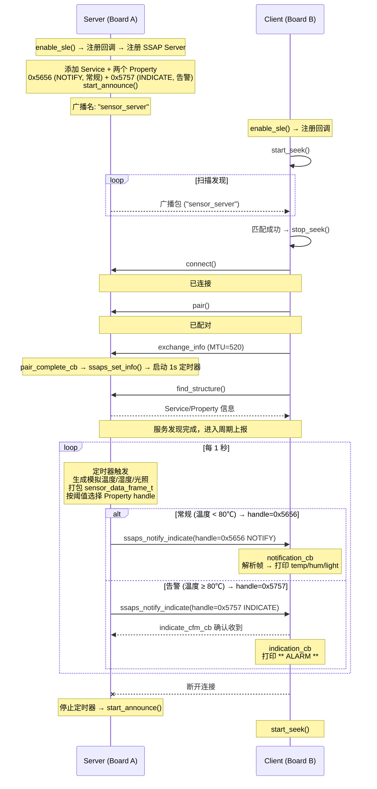
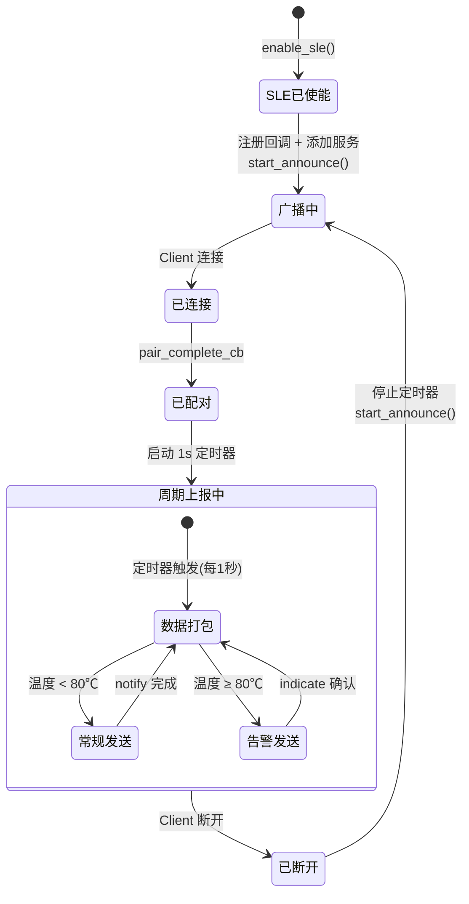
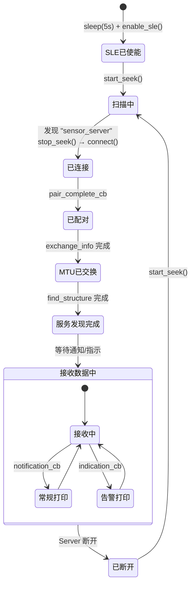

# SLE 传感器数据上报 应用设计文档

## 1. 概述

本应用基于 HiSpark WS63 平台的 SLE 协议栈，实现一个多传感器定时数据上报示例——这是 IoT 领域最基础也最高频的应用模式：

- **Server 端**：启动 SLE 广播，等待 Client 连接。连接配对完成后，启动 1 秒定时器，周期性生成模拟传感器数据（温度、湿度、光照），打包为结构化帧，通过 **SSAP Notification** 推送给 Client。当温度超过 80℃ 时，改为 **SSAP Indication** 发送告警帧，确保送达。
- **Client 端**：扫描并发现 Server，建立连接 → 配对 → MTU 交换 → 服务发现。接收 Server 推送的传感器数据帧，解析后在调试串口打印温度/湿度/光照值。

**核心特点：**
- 使用**定时器驱动**周期上报（非单次发送），模拟真实传感器产品行为
- 数据不依赖真实传感器硬件，由代码生成模拟值（正弦波表 + 随机数）
- **双 Property 设计** — SDK 的 `ssaps_notify_indicate()` 无法在调用时动态选择 Notification / Indication（行为由 CCCD 预先决定且互斥），因此用两个 Property 分别承载常规数据（0x5656, NOTIFY）和告警数据（0x5757, INDICATE），运行时按温度阈值选择对应 handle 发送

## 2. 目录结构

```
src/application/samples/bt/sle/sle_sensor_report/
├── DESIGN.md                              # 本设计文档
├── Kconfig                                # Kconfig 配置
├── CMakeLists.txt                         # 顶层编译脚本
├── sle_sensor_report_server/
│   ├── src/
│   │   ├── sle_sensor_report_server.h     # Server 头文件（UUID、帧结构体、API声明）
│   │   ├── sle_sensor_report_server.c     # Server 核心逻辑（服务注册、定时器、数据打包发送）
│   │   └── sle_sensor_report_server_adv.c # Server 广播配置
│   └── CMakeLists.txt
├── sle_sensor_report_client/
│   ├── src/
│   │   ├── sle_sensor_report_client.h     # Client 头文件（API声明）
│   │   └── sle_sensor_report_client.c     # Client 核心逻辑（扫描、连接、服务发现、数据解析）
│   └── CMakeLists.txt
└── sle_sensor_report.c                    # 应用入口（app_run、任务创建）
```

## 3. 端到端交互流程



## 4. 数据协议定义

### 4.1 传感器数据帧结构体

```c
#define SENSOR_FRAME_TYPE_PERIODIC  0x01  // 定时上报帧
#define SENSOR_FRAME_TYPE_ALARM     0x02  // 告警帧

typedef struct {
    uint8_t  frame_type;      // 帧类型: 0x01=定时上报, 0x02=告警
    uint8_t  sensor_count;    // 本帧传感器数量
    uint32_t timestamp;       // 采集时间戳 (ms)
    int16_t  temperature;     // 温度 (×100, 单位℃, 范围 -4000~+8500)
    uint8_t  humidity;        // 湿度 (0~100%)
    uint16_t light;           // 光照 (lux, 0~65535)
} __attribute__((packed)) sensor_data_frame_t;
// 总大小: 12 字节
```

### 4.2 模拟数据生成规则

传感器数据由 Server 在定时器回调中**模拟生成**，不依赖真实硬件：

| 传感器 | 生成方式 | 值范围 | 变化量/秒 |
|--------|---------|--------|:---:|
| 温度 | 基准值 25.0℃ + 简谐波波动 (±5℃) + 随机抖动 (±0.15℃), 逐步升温 (每秒 +1.0℃), 撞顶 85℃ 后回落至 ~65℃ | 20.0 ~ 85.0℃ | +1.0℃ |
| 湿度 | 基准值 60% + 随机波动 (±5%) | 45 ~ 75% | ±3% |
| 光照 | 基准值 1200 lux + 随机波动 (±200) | 500 ~ 2000 lux | ±100 |

温度逐步升温的设计使得示例运行约 1 分钟后自然触发 80℃ 告警阈值，验证 Indication 告警功能。

### 4.3 告警阈值定义

```c
#define TEMP_ALARM_HIGH     8000   // 80.00℃ (×100)
#define TEMP_ALARM_LOW      -1000  // -10.00℃ (×100)
#define HUMIDITY_ALARM_LOW  20     // 20%
```

## 5. SSAP 服务定义

### 5.1 UUID 分配

| 名称 | UUID | 说明 |
|------|------|------|
| App UUID | `{0x12, 0x34}` | Server 应用标识 |
| Service UUID | `0x5555` (16-bit) | 传感器数据服务 |
| 常规数据 Property UUID | `0x5656` (16-bit) | 定时上报（Notification） |
| 告警数据 Property UUID | `0x5757` (16-bit) | 超阈值告警（Indication） |

> UUID 采用 16-bit 编码：`uuid.len = 2`，16-bit 值写入 base UUID 的 index 14-15（参照 hello/uart 的 `sle_uuid_setu2`）。

### 5.2 双 Property 设计

SDK 的 `ssaps_notify_indicate()` 无法在调用时动态选择 Notification/Indication——行为由 CCCD 预先决定，且两种模式互斥。因此用**两个 Property** 分别承载：

| | 常规数据 Property (0x5656) | 告警数据 Property (0x5757) |
|---|---|---|
| operate_indication | READ \| NOTIFY | READ \| INDICATE |
| 描述符 | USER_DESCRIPTION, value=`{0x01,0x00}` | CCCD, value=`{0x02,0x00}` |
| 使能机制 | 描述符初始值预开启 | CCCD 初始值预开启 |

Server 定时器回调中按温度阈值选择对应 Property handle 发送。

### 5.3 数据传输方式

| 数据类型 | 传输方式 | Property | 触发条件 |
|---------|---------|---------|---------|
| 常规周期数据 | **Notification** (无需确认) | 0x5656 | 温度 < 80℃ |
| 告警数据 | **Indication** (需确认) | 0x5757 | 温度 ≥ 80℃ |

Server 通过 `ssaps_indicate_cfm_cb` 回调接收 Indication 的确认状态。

## 6. Server 端详细设计

### 6.1 文件: `sle_sensor_report_server.h`

```c
// UUID 定义
#define SENSOR_SERVICE_UUID          0x5555
#define SENSOR_DATA_PROPERTY_UUID    0x5656  // 常规数据 Property (NOTIFY)
#define SENSOR_ALARM_PROPERTY_UUID   0x5757  // 告警数据 Property (INDICATE)

// 广播名称
#define SENSOR_SERVER_NAME           "sensor_server"

// 定时器周期 (ms)
#define SENSOR_REPORT_INTERVAL_MS    1000

// 告警阈值 (×100)
#define TEMP_ALARM_HIGH              8000
#define TEMP_ALARM_LOW               (-1000)

// 传感器数据帧结构体
typedef struct {
    uint8_t  frame_type;      // 0x01=定时上报, 0x02=告警
    uint8_t  sensor_count;
    uint32_t timestamp;       // 采集时间戳 (ms)
    int16_t  temperature;     // 温度 (×100, ℃)
    uint8_t  humidity;        // 湿度 (0~100%)
    uint16_t light;           // 光照 (lux)
} __attribute__((packed)) sensor_data_frame_t;

// Server 初始化
errcode_t sle_sensor_report_server_init(void);
uint16_t sle_sensor_report_server_is_connected(void);
```

### 6.2 文件: `sle_sensor_report_server.c` — 初始化流程

```
sle_sensor_report_server_init()
  ├── enable_sle()                              // 使能 SLE 协议栈
  ├── sle_sensor_report_announce_register_cbks() // 注册广播回调
  │     └── sle_announce_seek_register_callbacks()
  ├── sle_sensor_report_conn_register_cbks()     // 注册连接回调
  │     └── sle_connection_register_callbacks()
  │           ├── connect_state_changed_cb
  │           ├── pair_complete_cb
  │           └── read_rssi_cb
  ├── sle_sensor_report_ssaps_register_cbks()    // 注册 SSAP Server 回调
  │     └── ssaps_register_callbacks()
  ├── sle_sensor_report_server_add()             // 添加 SSAP 服务
  │     ├── ssaps_register_server()
  │     ├── sle_sensor_report_add_service()      // Service UUID=0x5555
  │     ├── sle_sensor_report_add_data_property() // 常规数据 Property 0x5656 + USER_DESC
  │     ├── sle_sensor_report_add_alarm_property()// 告警数据 Property 0x5757 + CCCD
  │     └── ssaps_start_service()
  └── sle_sensor_report_server_adv_init()        // 初始化广播
        ├── sle_set_announce_param()
        ├── sle_set_announce_data()
        └── sle_start_announce()
```

### 6.3 广播参数配置

| 参数 | 值 | 说明 |
|------|-----|------|
| announce_mode | `SLE_ANNOUNCE_MODE_CONNECTABLE_SCANABLE` | 可连接可扫描 |
| announce_handle | `1` | 广播句柄 |
| announce_interval | `0xC8` (25ms) | 广播间隔 |
| conn_interval | `0x64` (12.5ms) | 连接间隔 |
| conn_supervision_timeout | `0x1F4` (5000ms) | 监管超时 |
| local_name | `"sensor_server"` | 本地设备名（放在扫描响应数据中） |
| own_addr | `{0x01, 0x02, 0x03, 0x04, 0x05, 0x06}` | 固定本地地址 |

### 6.4 配对完成 → 启动定时器

```
pair_complete_cbk(conn_id, addr, status)
  ├── 保存配对状态
  ├── ssaps_set_info(mtu=520, version=1)
  └── 启动 1 秒周期定时器:
        └── g_sensor_report_timer.handler = sensor_report_timer_cb
        └── g_sensor_report_timer.data = 0
        └── g_sensor_report_timer.interval = 1000
        └── osal_timer_init(&g_sensor_report_timer)
        └── osal_timer_start(&g_sensor_report_timer)
```

> **注意**: `osal_timer_init` 必须在设置 `handler` 和 `data` 后调用，此后不能再修改这两个字段。`interval` 在 `osal_timer_start` 前设置即可。定时器回调签名为 `void (*handler)(unsigned long)`，回调参数通过 `osal_timer_get_private_data()` 获取。
>
> 与 hello sample 的关键不同：hello 在配对完成后**立即发送一次** "hello world"；sensor-report 在配对完成后**启动定时器**，后续由定时器驱动周期性发送。

### 6.5 定时器回调：数据打包与发送

```
sensor_report_timer_cb(arg)  // arg 为 unsigned long
  ├── 检查连接状态 (!g_connected → return)
  ├── 生成模拟传感器数据:
  │     ├── temperature = get_simulated_temperature()  // 返回 ×100
  │     ├── humidity    = get_simulated_humidity()
  │     └── light       = get_simulated_light()
  ├── 获取时间戳:
  │     └── osal_gettimeofday(&tv)
  │         frame.timestamp = tv.tv_sec * 1000 + tv.tv_usec / 1000
  ├── 判断告警 → 选择 Property handle:
  │     ├── if (temperature > TEMP_ALARM_HIGH || temperature < TEMP_ALARM_LOW):
  │     │     ├── frame.frame_type = 0x02 (告警帧)
  │     │     └── prop_handle = g_alarm_property_handle  // 0x5757
  │     └── else:
  │           ├── frame.frame_type = 0x01 (常规帧)
  │           └── prop_handle = g_data_property_handle   // 0x5656
  └── 发送 (handle 决定走 Notification 还是 Indication):
        └── ssaps_ntf_ind_t param = {
              .handle = prop_handle,
              .type = SSAP_PROPERTY_TYPE_VALUE,
              .value = send_buf,
              .value_len = sizeof(send_buf)
            };
        └── ssaps_notify_indicate(g_server_id, g_sle_conn_hdl, &param);
```

### 6.6 模拟数据生成函数

```c
// 简谐波表: 16 点正弦近似 (x100), 幅值 ±500, 替代浮点 sinf()
static const int16_t g_sine_table[16] = {
    0, 195, 383, 500, 500, 383, 195, 0,
    0, -195, -383, -500, -500, -383, -195, 0
};

// 温度: 基准 25.0℃, 简谐波 ±5℃ + 随机抖动 ±0.15℃, 每秒 +1.0℃,
//       撞顶 85℃ 后回落至 ~65℃, 形成反复告警 ON/OFF
static int16_t get_simulated_temperature(void)
{
    static uint32_t call_count = 0;
    call_count++;
    int16_t drift = (int16_t)(call_count * 100);               // 每秒 +1.0℃
    int16_t sine  = g_sine_table[call_count & 0xF];            // 16 点简谐波 ±5℃
    int16_t noise = (int16_t)(rand() % 31 - 15);               // ±0.15℃ 随机抖动
    int16_t temp  = 2500 + drift + sine + noise;               // 25.00℃ 基准
    if (temp > 8500) {
        call_count = 40;  // 撞顶回落至 ~65℃
        temp = 8500;
    }
    if (temp < 2000) temp = 2000;
    return temp;
}

// 湿度: 基准 60%, 随机波动 ±5%, 范围 45~75%
static uint8_t get_simulated_humidity(void)
{
    int16_t val = 60 + (rand() % 11 - 5);  // 60 ± 5
    if (val < 45) val = 45;
    if (val > 75) val = 75;
    return (uint8_t)val;
}

// 光照: 基准 1200 lux, 随机波动 ±200, 范围 500~2000
static uint16_t get_simulated_light(void)
{
    int32_t val = 1200 + (rand() % 401 - 200);  // 1200 ± 200
    if (val < 500) val = 500;
    if (val > 2000) val = 2000;
    return (uint16_t)val;
}
```

### 6.7 连接状态变更回调逻辑

```
connect_state_changed_cbk(conn_id, addr, conn_state, pair_state, disc_reason)
  ├── SLE_ACB_STATE_CONNECTED:
  │     └── 保存 conn_id → g_sle_conn_hdl
  └── SLE_ACB_STATE_DISCONNECTED:
        ├── 停止定时器 (osal_timer_stop)
        ├── 清除 g_sle_conn_hdl
        └── 重新启动广播 (sle_start_announce)
```

## 7. Client 端详细设计

### 7.1 文件: `sle_sensor_report_client.h`

```c
// Client 初始化 (传入数据接收回调)
void sle_sensor_report_client_init(ssapc_notification_callback notification_cb,
                                    ssapc_indication_callback indication_cb);

// 启动扫描
void sle_sensor_report_client_start_scan(void);
```

### 7.2 文件: `sle_sensor_report_client.c` — 初始化流程

```
sle_sensor_report_client_init(notification_cb, indication_cb)
  ├── osal_msleep(5000)                              // 等待 SLE 核心就绪
  ├── sle_sensor_report_seek_cbk_register()           // 注册扫描回调
  │     └── sle_announce_seek_register_callbacks()
  │           ├── sle_enable_cb
  │           ├── seek_enable_cb / seek_disable_cb
  │           └── seek_result_cb
  ├── sle_sensor_report_connect_cbk_register()        // 注册连接回调
  │     └── sle_connection_register_callbacks()
  │           ├── connect_state_changed_cb
  │           └── pair_complete_cb
  ├── sle_sensor_report_ssapc_cbk_register()          // 注册 SSAP Client 回调
  │     └── ssapc_register_callbacks()
  │           ├── exchange_info_cb
  │           ├── find_structure_cb / find_property_cbk
  │           ├── find_structure_cmp_cb
  │           ├── notification_cb  ← 接收常规传感器数据
  │           └── indication_cb    ← 接收告警数据
  └── enable_sle()                                    // 使能 SLE
```

### 7.3 扫描与连接流程

与 hello sample 相同：扫描 → 匹配 `"sensor_server"` → 停止扫描 → 连接 → 配对 → MTU 交换 → 服务发现。关键区别在于匹配字符串为 `"sensor_server"`。

### 7.4 数据接收回调

```c
// notification_cb — 接收常规传感器数据
void sle_sensor_report_notification_cb(uint8_t client_id, uint16_t conn_id,
                                        ssapc_handle_value_t *data, errcode_t status)
{
    if (data == NULL || data->data == NULL ||
        data->data_len != sizeof(sensor_data_frame_t)) {
        return;
    }

    sensor_data_frame_t *frame = (sensor_data_frame_t *)data->data;
    osal_printk("[sensor client] [T=%ums] temp=%d.%02dC, hum=%u%%, light=%ulux, type=0x%02x\r\n",
                frame->timestamp,
                frame->temperature / 100,
                (frame->temperature >= 0) ? (frame->temperature % 100) : (-frame->temperature % 100),
                frame->humidity,
                frame->light,
                frame->frame_type);
}

// indication_cb — 接收告警数据
void sle_sensor_report_indication_cb(uint8_t client_id, uint16_t conn_id,
                                      ssapc_handle_value_t *data, errcode_t status)
{
    if (data == NULL || data->data == NULL) {
        return;
    }

    sensor_data_frame_t *frame = (sensor_data_frame_t *)data->data;
    osal_printk("[sensor client] ** ALARM ** temp=%d.%02dC exceeds threshold! type=0x%02x\r\n",
                frame->temperature / 100,
                (frame->temperature >= 0) ? (frame->temperature % 100) : (-frame->temperature % 100),
                frame->frame_type);
}
```

## 8. 应用入口设计

### 8.1 文件: `sle_sensor_report.c`

```c
// Server 任务
void *sle_sensor_report_server_task(const char *arg) {
    sle_sensor_report_server_init();  // 初始化 + 启动广播
    // 不需要循环 — 定时器驱动发送, 回调驱动状态变更
    return NULL;
}

// Client 任务
void *sle_sensor_report_client_task(const char *arg) {
    sle_sensor_report_client_init(sle_sensor_report_notification_cb,
                                   sle_sensor_report_indication_cb);
    return NULL;
}

// 应用入口
static void sle_sensor_report_entry(void) {
    osal_kthread_lock();
#if defined(CONFIG_SLE_SENSOR_REPORT_SERVER)
    task = osal_kthread_create(sle_sensor_report_server_task, 0,
                                "SensorReportServer", 0x1000);
#elif defined(CONFIG_SLE_SENSOR_REPORT_CLIENT)
    task = osal_kthread_create(sle_sensor_report_client_task, 0,
                                "SensorReportClient", 0x1000);
#endif
    osal_kthread_set_priority(task, 28);
    osal_kthread_unlock();
}

app_run(sle_sensor_report_entry);
```

## 9. 状态机

### 9.1 Server 状态机



### 9.2 Client 状态机



## 10. Kconfig 配置

父级 `application/samples/bt/sle/Kconfig` 的 choice 块中增加两个条目：

```kconfig
config SAMPLE_SUPPORT_SLE_SENSOR_REPORT_SERVER_SAMPLE
    bool "Support SLE Sensor Report Server Sample."

config SAMPLE_SUPPORT_SLE_SENSOR_REPORT_CLIENT_SAMPLE
    bool "Support SLE Sensor Report Client Sample."
```

本 sample 的 `Kconfig` 仅处理派生配置：

```kconfig
config SUPPORT_SLE_PERIPHERAL
    bool
    default y if SAMPLE_SUPPORT_SLE_SENSOR_REPORT_SERVER_SAMPLE

config SUPPORT_SLE_CENTRAL
    bool
    default y if SAMPLE_SUPPORT_SLE_SENSOR_REPORT_CLIENT_SAMPLE
```

## 11. 编译配置

### 11.1 父级 CMakeLists.txt

`application/samples/bt/sle/CMakeLists.txt` 中增加：

```cmake
if(DEFINED CONFIG_SAMPLE_SUPPORT_SLE_SENSOR_REPORT_SERVER_SAMPLE OR
   DEFINED CONFIG_SAMPLE_SUPPORT_SLE_SENSOR_REPORT_CLIENT_SAMPLE)
    add_subdirectory_if_exist(sle_sensor_report)
endif()
```

### 11.2 顶层 CMakeLists.txt

```cmake
if(DEFINED CONFIG_SAMPLE_SUPPORT_SLE_SENSOR_REPORT_SERVER_SAMPLE)
    add_subdirectory_if_exist(sle_sensor_report_server)
endif()
if(DEFINED CONFIG_SAMPLE_SUPPORT_SLE_SENSOR_REPORT_CLIENT_SAMPLE)
    add_subdirectory_if_exist(sle_sensor_report_client)
endif()
```

## 12. 关键 API 引用

| API | 所属模块 | 用途 | 新增/复用 |
|-----|---------|------|:---:|
| `enable_sle()` | sle_device_discovery | 使能 SLE 协议栈 | 复用 |
| `sle_announce_seek_register_callbacks()` | sle_device_discovery | 注册广播/扫描回调 | 复用 |
| `sle_set_announce_param()` | sle_device_discovery | 设置广播参数 | 复用 |
| `sle_start_announce()` | sle_device_discovery | 启动广播 | 复用 |
| `sle_start_seek()` / `sle_stop_seek()` | sle_device_discovery | 启动/停止扫描 | 复用 |
| `sle_connection_register_callbacks()` | sle_connection_manager | 注册连接回调 | 复用 |
| `sle_connect_remote_device()` | sle_connection_manager | 发起连接 | 复用 |
| `sle_pair_remote_device()` | sle_connection_manager | 发起配对 | 复用 |
| `ssaps_register_server()` | sle_ssap_server | 注册 SSAP Server | 复用 |
| `ssaps_add_service_sync()` | sle_ssap_server | 添加 Service | 复用 |
| `ssaps_add_property_sync()` | sle_ssap_server | 添加 Property | 复用 |
| `ssaps_start_service()` | sle_ssap_server | 启动服务 | 复用 |
| `ssaps_set_info()` | sle_ssap_server | 设置 MTU/版本信息 | 复用 |
| `ssaps_notify_indicate()` | sle_ssap_server | Server 发送通知/指示 (通过 `ssaps_ntf_ind_t *param` 传参) | 复用 |
| `ssaps_register_callbacks()` | sle_ssap_server | 注册 SSAP Server 回调 | 复用 |
| `ssapc_register_callbacks()` | sle_ssap_client | 注册 SSAP Client 回调 | 复用 |
| `ssapc_exchange_info_req()` | sle_ssap_client | Client 发起 MTU 交换 | 复用 |
| `ssapc_find_structure()` | sle_ssap_client | Client 发起服务发现 | 复用 |
| `osal_timer_init()` | soc_osal | 初始化定时器（需先设置 handler/data） | **新增** |
| `osal_timer_start()` / `osal_timer_stop()` | soc_osal | 启动/停止定时器 | **新增** |
| `osal_gettimeofday()` | soc_osal | 获取系统时间（秒+微秒），手动换算为毫秒时间戳 | **新增** |
| `osal_printk()` | soc_osal | 调试日志打印 | 复用 |
| `osal_kthread_create()` | soc_osal | 创建 OS 线程 | 复用 |
| `app_run()` | app_init | 注册应用入口函数 | 复用 |

## 13. 与 hello sample 的差异说明

相比于 `sle_hello` sample（单次发送 "hello world"），本应用的变化：

| 差异点 | sle_hello | sle_sensor_report |
|--------|-----------|-------------------|
| 数据发送方式 | 配对完成后**单次发送** | 配对完成后**启动定时器周期性发送**（每 1 秒） |
| 发送内容 | 固定字符串 "hello world" | 结构化帧 `sensor_data_frame_t`（温度/湿度/光照/时间戳） |
| 数据类型 | 全部 Notification | Notification + Indication 混用（常规/告警） |
| 数据来源 | 硬编码字符串 | 模拟数据生成函数（正弦波、随机波动） |
| 定时器 | 不需要 | `osal_timer_init` + `osal_timer_start` |
| 时间戳 | 不需要 | `osal_gettimeofday()` 手动换算毫秒 |
| Property 操作指示 | NOTIFY | NOTIFY + INDICATE |
| 硬件依赖 | 无 | 无（数据全部模拟生成，不需要真实传感器） |
| 连接断开处理 | 重新广播 | 停止定时器 + 重新广播 |
