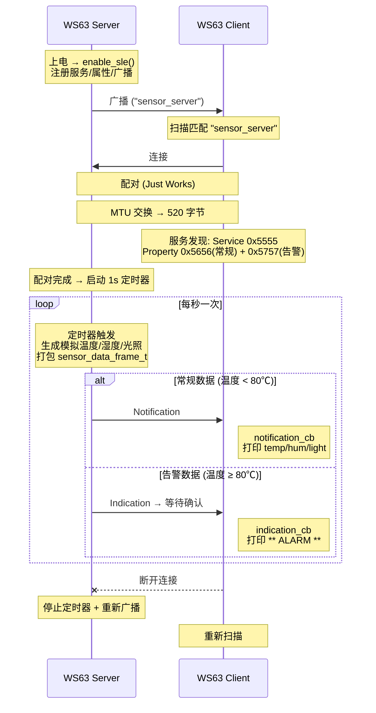

# SLE Sensor Report — 多传感器定时数据上报

基于 WS63 SLE 的传感器数据周期上报示例。Server 端每 1 秒生成模拟温度/湿度/光照数据，通过 Notification 推送给 Client；当温度超过 80℃ 时自动切换为 Indication 告警。是 IoT 传感采集场景最基础也最高频的应用模式。

> 前置知识：广播/连接、通知推送、指示确认。建议先完成 [sle_hello](../sle_hello/) 示例熟悉建链流程。

## 功能规格

| 规格项 | Server 端 | Client 端 |
|--------|----------|----------|
| 广播/扫描 | 上电后以 "sensor_server" 名称持续广播 | 上电后扫描并匹配 "sensor_server" |
| 配对 | 被动等待配对 (Just Works) | 连接成功后主动发起配对 |
| MTU | 配对完成后设置 520 字节 | 配对完成后发起 MTU 交换 |
| 服务发现 | — | 遍历 Server 的 Service / Property / Descriptor |
| 周期上报 | 配对完成后启动 1s 定时器，每 tick 生成模拟数据并推送 | notification_cb 接收并打印传感器数据 |
| 告警推送 | 温度 ≥ 80℃ 或 < -10℃ 时，帧类型标记为 ALARM | indication_cb 接收并打印告警信息 |
| 数据传输 | Notification (常规) / Indication (告警)，由 CCCD 控制 | — |
| 连接管理 | 断开后停止定时器 + 重新广播 | 断开后重新扫描 |

## 通信流程



## 数据帧格式

```c
#define SENSOR_FRAME_TYPE_PERIODIC  0x01  // 定时上报帧
#define SENSOR_FRAME_TYPE_ALARM     0x02  // 告警帧

typedef struct {
    uint8_t  frame_type;      // 帧类型: 0x01=定时上报, 0x02=告警
    uint8_t  sensor_count;    // 本帧传感器数量
    uint32_t timestamp;       // 采集时间戳 (ms)
    int16_t  temperature;     // 温度 (×100, 单位℃, 范围 -4000~+8500)
    uint8_t  humidity;        // 湿度 (0~100%)
    uint16_t light;           // 光照 (lux, 0~65535)
} __attribute__((packed)) sensor_data_frame_t;
// 总大小: 12 字节
```

## 模拟数据生成规则

传感器数据由 Server 在定时器回调中**模拟生成**，不依赖真实硬件：

| 传感器 | 生成方式 | 值范围 | 变化量/秒 |
|--------|---------|--------|:---:|
| 温度 | 基准值 25.0℃ + 简谐波 (±5℃) + 随机抖动 (±0.15℃), 逐步升温 (每秒 +1.0℃), 撞顶 85℃ 后回落至 ~65℃ | 20.0 ~ 85.0℃ | +1.0℃ |
| 湿度 | 基准值 60% + 随机波动 (±5%) | 45 ~ 75% | ±3% |
| 光照 | 基准值 1200 lux + 随机波动 (±200) | 500 ~ 2000 lux | ±100 |

温度逐步升温的设计使得示例运行约 **1 分钟**后自然触发 80℃ 告警阈值，验证 Indication 告警功能。

## SSAP 服务定义

SDK 的 `ssaps_notify_indicate()` 无法在调用时动态选择 Notification/Indication——行为由 CCCD 预先决定。因此用**双 Property** 分别承载常规数据和告警数据：

| 项目 | 常规数据 Property | 告警数据 Property |
|------|---------|---------|
| UUID | 0x5656 | 0x5757 |
| operate_indication | READ \| NOTIFY | READ \| INDICATE |
| 描述符 | USER_DESCRIPTION, value=`{0x01,0x00}` | CCCD, value=`{0x02,0x00}` |
| 使能方式 | 描述符初始值预开启 | CCCD 初始值预开启 |

UUID 使用 16-bit 格式（`uuid.len = 2`），16-bit 值写入 base UUID 的 index 14-15。base UUID 为 `{0x37, 0xBE, 0xA8, 0x80, 0xFC, 0x70, 0x11, 0xEA, 0xB7, 0x20, 0x00, 0x00, 0x00, 0x00, 0x00, 0x00}`。

### Notification 与 Indication

| 数据类型 | 传输方式 | Property | 触发条件 |
|---------|---------|---------|---------|
| 常规周期数据 | Notification (无需确认) | 0x5656 | 温度 < 80℃ |
| 告警数据 | Indication (需确认) | 0x5757 | 温度 ≥ 80℃ |

Server 通过 `ssaps_indicate_cfm_cb` 接收 Indication 的确认状态。

## 广播参数

| 参数 | 值 | 说明 |
|------|----|------|
| 设备名称 | "sensor_server" | 广播/扫描响应中携带 |
| 连接间隔 | 12.5ms (0x64) | 1.25ms 为单位 |
| 广播间隔 | 25ms (0xC8) | 0.625ms 为单位 |
| 监控超时 | 5000ms (0x1F4) | 10ms 为单位 |
| 最大延迟 | 624ms (0x1F3) | 连接事件数 |
| 发射功率 | 18 dBm | — |
| 广播模式 | CONNECTABLE_SCANABLE | 可连接可扫描 |
| G/T 角色 | T_CAN_NEGO | 终端可协商 |
| 广播 PHY | 1M | — |
| 扫描参数 | 间隔 100, 窗口 100 | 1.25ms 为单位 (12.5ms) |
| 扫描类型 | Active | 主动扫描 |

## 告警阈值

| 阈值 | 值 (×100) | 触发条件 |
|------|-----------|---------|
| 温度过高 | 8000 (80.00℃) | 温度 > 80℃ |
| 温度过低 | -1000 (-10.00℃) | 温度 < -10℃ |

## 工程结构

```
sle_sensor_report/
├── CMakeLists.txt
├── Kconfig
├── sle_sensor_report.c                    # 入口: 定义回调, 创建任务, 分支到 server/client
├── sle_sensor_report_server/
│   ├── CMakeLists.txt
│   └── src/
│       ├── sle_sensor_report_server.h      # 服务 UUID / 帧结构体 / 告警阈值 / API 声明
│       ├── sle_sensor_report_server.c      # Server 核心: 服务注册, 定时器, 模拟数据生成, 发送
│       └── sle_sensor_report_server_adv.c  # 广播参数配置: 名称, 间隔, 功率
└── sle_sensor_report_client/
    ├── CMakeLists.txt
    └── src/
        ├── sle_sensor_report_client.h      # Client API: init, is_connected, start_scan
        └── sle_sensor_report_client.c      # Client 核心: 扫描匹配, 连接配对, 服务发现, 数据解析
```

> `sle_sensor_report.c` 通过 `CONFIG_SLE_SENSOR_REPORT_SERVER` / `CLIENT` 条件编译，选择 Server 或 Client 逻辑。`sensor_data_frame_t` 在入口文件和 server 头文件中分别定义（编译时互斥）。

## 构建与烧录

通过 menuconfig 选择 Server 或 Client 构建目标：

```
Top → Application → Samples → BT → SLE → SLE Sensor Report
  → [*] SLE Sensor Report Server    (编译 Server)
  → [*] SLE Sensor Report Client    (编译 Client)
```

> Kconfig 中的 `choice` 组是互斥的——Server 和 Client 不能同时设为 y。如需两块板通信，需分别编译两次。

```bash
fbb build ws63-liteos-app -p menuconfig
fbb build ws63-liteos-app
```

固件路径: `output/ws63/fwpkg/ws63-liteos-app/ws63-liteos-app_all.fwpkg`

## 预期输出

两块板子上电后，Server 自动广播、Client 自动扫描连接，无需区分上电顺序。

**Server 端串口输出:**

```
[sensor server adv] set announce data success.
[sensor server adv] start announce success.
[sensor server] init complete.
[sensor server] connected, conn_id: 0x00
[sensor server] pair complete, conn_id: 0x00
[sensor server] 1s periodic timer started.
[sensor server] ** ALARM ** temp=80.3C, sending via Indication
```

**Client 端串口输出:**

```
[sensor client] start seek.
[sensor client] found sensor_server, stop seek.
[sensor client] connected, conn_id: 0x00
[sensor client] pair complete, conn_id: 0x00
[sensor client] find structure complete
[sensor client] service discovery done, waiting for sensor data...
[sensor client] [T=25470ms] temp=28.5C, hum=62%, light=1350lux, type=0x01
[sensor client] ** ALARM ** temp=82.3C exceeds threshold! type=0x02
```

## 注意事项

- 两块板子均可先上电，Server 持续广播、Client 持续扫描，无需固定上电顺序
- 温度约 **1 分钟**后达到 80℃ 告警阈值，此时帧类型变为 `0x02` (ALARM)
- 模拟数据使用 8 点整数简谐波表替代浮点 `sinf()`，无需链接数学库
- 定时器 `osal_timer_init` 必须在设置 `handler` 和 `data` 后调用，此后不能再修改这两个字段
- 连接断开后 Server 自动停止定时器并恢复广播；Client 自动重新扫描
- 本示例使用 Just Works 配对（无 MITM 保护），生产环境建议启用安全配对
