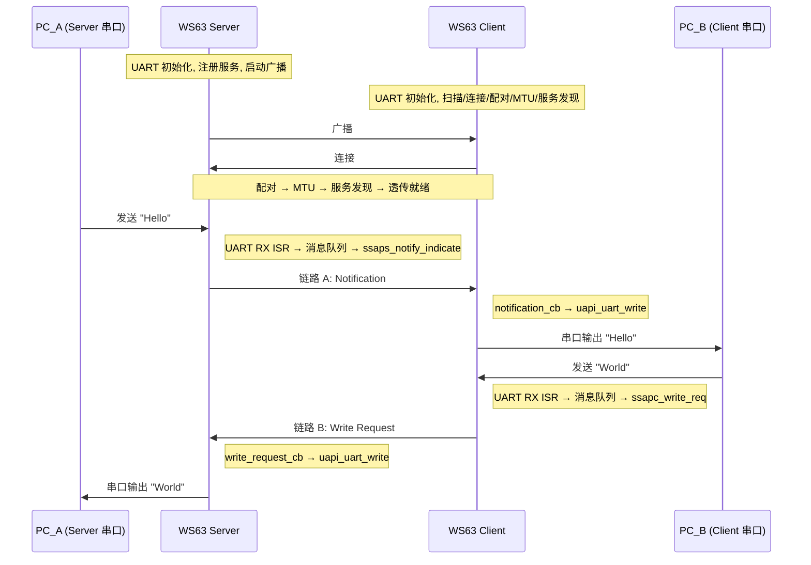

# SLE UART Bridge — 无线串口透传

基于 WS63 SLE 的 UART 双向透传示例。两块 WS63 分别接在串口设备两端，通过 SLE 无线链路透明传输数据——对两侧设备来说，这就是一根"无线串口延长线"。

> 前置知识：广播/连接、通知推送(sle_hello)、读写交互(sle_speed)。本篇将三者与 UART 驱动组合，构建完整的双向数据通道。

## 功能规格

| 规格项 | Server 端 | Client 端 |
|--------|----------|----------|
| 广播/扫描 | 上电后持续广播 | 上电后扫描并连接 Server |
| 配对 | 被动等待配对 | 连接成功后主动发起配对 |
| MTU | 配对完成后设置 520 字节 | 配对完成后发起 MTU 交换 |
| 服务发现 | — | 遍历 Server 的 Service / Property / Descriptor |
| 链路 A (Server→Client) | UART RX → Notification 推送 | notification_cb → UART TX 吐出 |
| 链路 B (Client→Server) | write_request_cb → UART TX 吐出 | UART RX → Write Request 发送 |
| 连接管理 | 断开后自动重新广播 | 断开后自动重新扫描 |

## 典型应用场景

- **工业传感器网关**: RS485 传感器数据通过 SLE 无线汇聚到网关
- **无线调试器**: 远程 MCU 的调试串口通过 SLE 映射到本地 PC
- **数传模块替代**: 用 SLE 替代传统 433MHz/2.4GHz 数传模块
- **智能设备配网/配置**: 手机通过 SLE 串口透传向设备发送配置指令

## 通信流程与数据流

下图展示从两块板子上电到双向透传的完整流程，包含建链过程和两条数据链路：



两条链路独立运行，互不阻塞：

| 链路 | 方向 | 数据路径 | SLE API |
|------|------|---------|---------|
| **A** | Server → Client | UART RX ISR → 消息队列 → `ssaps_notify_indicate()` → `notification_cb` → UART TX | Notification |
| **B** | Client → Server | UART RX ISR → 消息队列 → `ssapc_write_req()` → `write_request_cb` → UART TX | Write Request |

**为什么用消息队列？** UART RX 回调在 ISR 上下文中执行，不能直接调用 SLE 发送 API（内部可能阻塞、加锁或触发调度）。消息队列将数据从 ISR 安全传递到任务上下文——ISR 只负责校验和写入队列，任务从队列读数据后调用 SLE API。两端采用完全对称的 ISR→消息队列→任务架构。

## 硬件连接

```
PC_A ←→ USB-TTL ←→ WS63_A (Server) ~~~~ SLE 无线 ~~~~ WS63_B (Client) ←→ USB-TTL ←→ PC_B
```

| 信号 | GPIO | 用途 |
|------|------|------|
| UART1 TX | 15 | 数据发送 |
| UART1 RX | 16 | 数据接收 |

> USB-TTL 的 RX 接 WS63 的 TX，TX 接 WS63 的 RX，GND 接 GND。引脚可通过 Kconfig 修改。

## 工程结构

```
sle_uart/
├── CMakeLists.txt
├── Kconfig
├── sle_uart.c                  # 入口: 创建任务, Server/Client 通用逻辑
├── sle_uart_server/
│   ├── CMakeLists.txt
│   ├── sle_uart_server.c       # Server: 服务注册, 通知发送, 连接管理
│   ├── sle_uart_server.h
│   ├── sle_uart_server_adv.c   # Server: 广播配置
│   └── sle_uart_server_adv.h
└── sle_uart_client/
    ├── CMakeLists.txt
    ├── sle_uart_client.c       # Client: 扫描, 连接, 写请求, 服务发现
    └── sle_uart_client.h
```

> `sle_uart.c` 通过 `CONFIG_SAMPLE_SUPPORT_SLE_UART_SERVER_SAMPLE` / `CLIENT_SAMPLE` 条件编译，选择 Server 或 Client 逻辑。

## Kconfig 配置

| 选项 | 默认值 | 说明 |
|------|--------|------|
| `UART_BUS_ID` | 1 | 数据 UART 总线 ID |
| `UART_TXD_PIN` / `UART_RXD_PIN` | 15 / 16 | UART 收发引脚 |
| `UART_TXD_PIN_MODE` / `UART_RXD_PIN_MODE` | 1 | 引脚复用模式 |
| `SLE_UART_BAUDRATE` | 115200 | UART 波特率 |
| `SLE_UART_RX_BUF_SIZE` | 512 | UART 接收缓冲区 (字节) |
| `SLE_UART_MSGQ_LEN` | 16 | 消息队列深度 |
| `SLE_UART_MSGQ_ITEM_SIZE` | 520 | 消息队列每项最大字节数 |
| `SLE_UART_MTU_SIZE` | 520 | SLE MTU 大小 |
| `SLE_UART_CONN_INTERVAL` | 12 | 连接间隔 (x1.25ms, 范围 6~32) |

## 构建与烧录

**编译 Server 固件:**

在 `ws63_liteos_app.config` 中设置:

```
CONFIG_SAMPLE_SUPPORT_SLE_SAMPLE=y
CONFIG_SAMPLE_SUPPORT_SLE_UART_SERVER_SAMPLE=y
# CONFIG_SAMPLE_SUPPORT_SLE_UART_CLIENT_SAMPLE is not set
```

```bash
fbb build --clean ws63-liteos-app
```

**编译 Client 固件:**

改为启用 Client（其余参数保持不变）:

```
# CONFIG_SAMPLE_SUPPORT_SLE_UART_SERVER_SAMPLE is not set
CONFIG_SAMPLE_SUPPORT_SLE_UART_CLIENT_SAMPLE=y
```

```bash
fbb build --clean ws63-liteos-app
```

固件路径: `output/ws63/fwpkg/ws63-liteos-app/ws63-liteos-app_all.fwpkg`

## 验证透传

1. **先给 Server 上电**，串口输出:

```
[sle uart server] uart init ok, baud=115200
[sle uart server] service added, ready for connection
[sle uart server] waiting for connection...
[sle uart server] connected, conn_id=0x00
[sle uart server] pair complete
[sle uart server] === bridge ready ===
```

2. **再给 Client 上电**，串口输出:

```
[sle uart client] uart init ok, baud=115200
[sle uart client] scanning for uart_server...
[sle uart client] found uart_server, connecting...
[sle uart client] connected, conn_id=0x00
[sle uart client] pair complete
[sle uart client] service discovery complete
[sle uart client] === bridge ready ===
```

3. PC_A 串口助手发 "Hello" → PC_B 串口助手收到 "Hello"
4. PC_B 串口助手发 "World" → PC_A 串口助手收到 "World"

双向收发正常即为成功。

## 性能参考

> 以下基于 115200bps、连接间隔 12.5ms、1M PHY、MTU 520 字节。

| 指标 | 典型值 | 说明 |
|------|--------|------|
| 单向吞吐 | ~10 KB/s | 受限于串口波特率，SLE 不构成瓶颈 |
| 单包延迟 | 15~30 ms | 连接间隔为主要延迟来源 |
| 丢包 | 仅队列满时发生 | 增大 `MSGQ_LEN` 可缓解 |

## 注意事项

- 连接断开后 Server 自动恢复广播；Client 需复位重连
- 未连接时收到的 UART 数据会被丢弃
- UART RX 每次回调的数据量取决于发送端写入节奏，透传层按原样转发不做组帧——需要完整帧协议的应用应在上层自行处理
- 消息队列满时丢包，日志输出 drop 计数 (前 3 次 + 每 100 次汇总)
