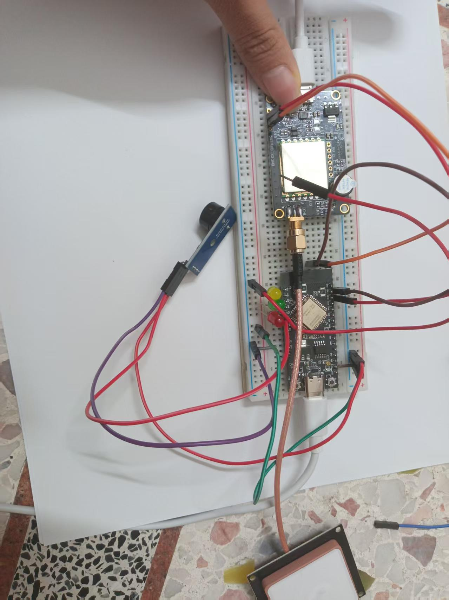
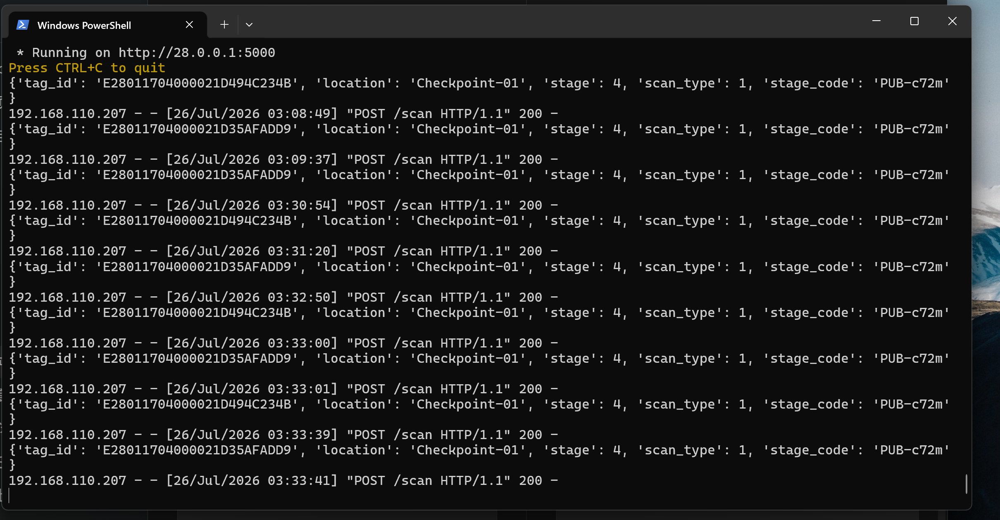
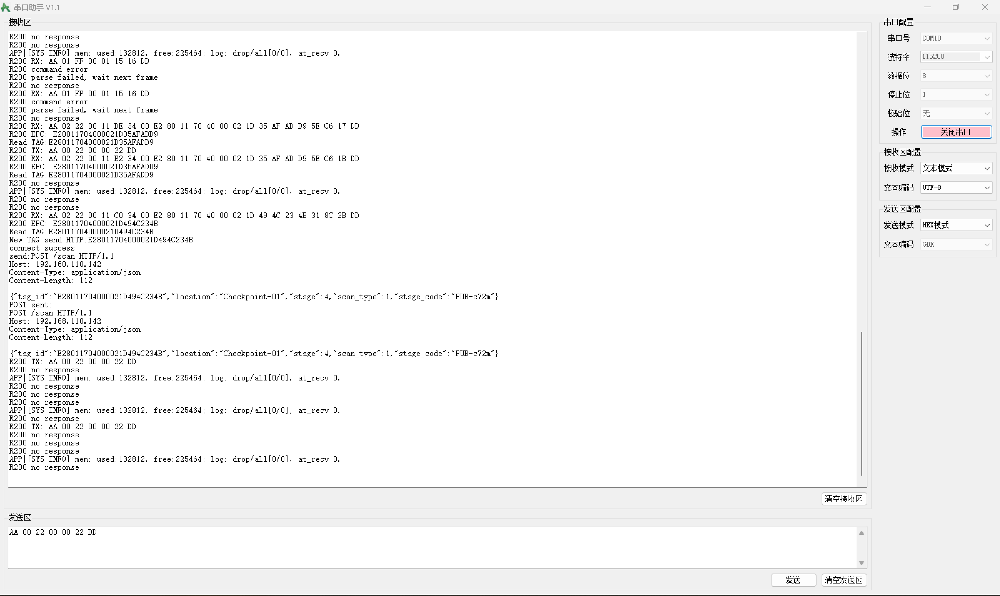

# ClearChain 硬件扫描模块阶段交付报告

负责人：郑柔纯  
交付日期：2026-07-26  
项目：ClearChain - 基于 AI 驱动的智能药品供应链认证系统  
阶段：7 月 14 日 - 7 月 26 日个人学习与模块独立开发阶段

## 1. 阶段目标

根据团队 30 天赛前执行计划，硬件负责人在 2026 年 7 月 26 日前需要完成一个可运行、可测试、可展示的独立硬件扫描模块。硬件模块主要承担 RFID 标签读取、WS63 无线通信、JSON 数据组包与后端接口发送等功能。

## 2. 当前完成情况

| 模块 | 状态 | 说明 |
| --- | --- | --- |
| R200 UHF RFID 模块 | 已完成核心测试 | 厂家 Demo 可读 EPC，WS63 端也已成功读取 EPC |
| WS63 WiFi | 已完成 | WS63 已连接 WiFi，并获取 IP：192.168.110.207 |
| WS63 UART1 通信 | 已完成 | UART1 115200 8N1，可向 R200 发送盘点命令 |
| R200 返回解析 | 已完成核心功能 | 已解析出 UHF EPC，例如 E28011704000021D35AFADD9 |
| HTTP POST 组包 | 基本完成 | 已按队友要求组装 /scan 的五个 JSON 字段 |
| Mock 后端联调 | 部分完成 | 已能向本地 IP 发送 POST，等待队友提供公网 mock/ngrok 地址 |
| RGB LED | 未接入 | 当前阶段未接线，后续可作为状态反馈扩展 |
| 蜂鸣器 | 未接入 | 当前阶段未接线，后续可作为风险报警扩展 |

当前阶段一验收口径：

- WS63 开发板配置、WiFi 连接、UART1 初始化和 R200 读卡主流程已完成。
- 硬件侧已经能够完成 EPC 读取、JSON 组包和 `POST /scan` 发送的核心链路。
- 当前仍需在阶段二继续提升 R200 读卡稳定性，并等待后端公网或 mock 地址后进行系统级联调。

## 3. 硬件连接说明

当前硬件使用 WS63 开发板与 R200 UHF RFID 模块连接。

| R200 引脚 | WS63 引脚 | 说明 |
| --- | --- | --- |
| TX | RX | R200 发送数据到 WS63 |
| RX | TX | WS63 发送命令到 R200 |
| GND | GND | 共地 |
| 5V | 5V | R200 供电 |

实物接线照片：



## 4. 软件工程位置

WS63 工程路径：

```text
D:\ws\fbb\src\application\ws63\ws63_liteos_application\project
```

核心文件：

| 文件 | 作用 |
| --- | --- |
| `clearchain_config.h` | WiFi、后端 IP、端口、接口路径和固定 JSON 字段配置 |
| `clearchain_http.c` | 构造 JSON 和 HTTP POST 请求 |
| `tcp_client_demo.c` | 主任务：连接 WiFi、初始化 R200、读取 EPC、发送 HTTP |
| `r200_uart.c` | R200 UART1 初始化与读写 |
| `r200_reader.c` | R200 盘点命令发送和返回帧读取 |
| `r200_protocol.c` | R200 协议帧构造、校验和 EPC 解析 |

## 5. R200 读卡测试结果

WS63 已经成功通过 UART1 向 R200 发送盘点命令。当前固件使用单轮多标签盘点命令：

```text
R200 TX: AA 00 27 00 03 22 00 01 4D DD
```

该命令与厂家 Demo 软件的多标签盘点协议一致，但只盘点 1 轮，便于在 WS63 主循环中按 1 秒左右间隔重复检测标签。

R200 返回帧中已成功解析 EPC：

```text
R200 RX: AA 02 22 00 11 ... DD
R200 EPC: E28011704000021D35AFADD9
Read TAG:E28011704000021D35AFADD9
```

测试截图：





## 6. POST 数据格式

根据后端队友要求，当前硬件端发送 `/scan` 接口，只包含以下五个字段：

```json
{
  "tag_id": "E28011704000021D35AFADD9",
  "location": "Checkpoint-01",
  "stage": 4,
  "scan_type": 1,
  "stage_code": "PUB-c72m"
}
```

字段说明：

| 字段 | 类型 | 当前值 | 说明 |
| --- | --- | --- | --- |
| `tag_id` | string | 实际读取到的 EPC | RFID 标签 ID |
| `location` | string | `Checkpoint-01` | 扫描点位 |
| `stage` | number | `4` | 供应链阶段编号 |
| `scan_type` | number | `1` | 扫描类型 |
| `stage_code` | string | `PUB-c72m` | 阶段编码 |

当前串口日志中已出现：

```text
New TAG send HTTP:E28011704000021D494C234B
connect success
send: POST /scan HTTP/1.1
Host: 192.168.110.142
Content-Type: application/json
Content-Length: 112
```

## 7. 当前存在的问题

1. R200 读卡仍存在偶发不稳定现象：

```text
R200 command error
R200 no response
R200 parse failed, wait next frame
```

该现象不是主链路失败，因为同一套连接下已经多次读出 EPC。更可能与标签距离、天线角度、R200 忙状态、供电稳定性、连续盘点间隔有关。

2. 后端公网地址尚未提供。

当前代码中后端地址仍为本地局域网地址：

```c
#define SERVER_IP "192.168.110.142"
#define SERVER_PORT 5000
#define SERVER_PATH "/scan"
```

后续需要等待队友提供 mock/ngrok 地址后再修改并烧录。

3. RGB LED 和蜂鸣器尚未接入。

当前阶段主要完成 RFID 读取与网络发送主链路，LED 与蜂鸣器可在阶段二系统集成时作为状态反馈和风险报警功能继续补充。

## 8. 稳定性优化建议

为了保证演示效果，建议测试时采用以下方式：

1. 标签贴近天线并保持固定角度。
2. R200 使用稳定 5V 供电，避免由面包板接触不良导致掉电。
3. 每次读卡间隔保持 1000 ms 左右，避免 R200 忙状态。
4. 读到 EPC 后只发送一次 HTTP，避免同一标签重复提交。
5. 演示前先用厂家 Demo 确认标签和 R200 模块本身正常。

## 9. 7 月 26 日阶段结论

截至 2026 年 7 月 26 日，硬件扫描模块已经完成独立运行所需的核心链路：

```text
UHF 标签
  -> R200 读取 EPC
  -> UART1 返回 WS63
  -> WS63 解析 EPC
  -> WS63 组装 JSON
  -> WS63 通过 WiFi 发送 POST /scan
```

该模块已经达到阶段一“可运行、可测试、可展示”的要求。后续阶段重点是等待后端提供公网 mock 地址，并与 Flask 后端和 HarmonyOS Dashboard 进行系统级联调。

## 10. 最新进度更新（2026-07-26）

目前硬件负责人郑柔纯的阶段一任务已经基本完成，可以向团队说明：

```text
WS63 开发板与 R200 UHF RFID 模块已完成核心配置，WiFi、UART1、EPC 读取、JSON 组包和 POST /scan 主链路已跑通。当前硬件扫描模块已达到阶段一可运行、可测试、可展示要求。
```

已确认事项：

- R200 UHF RFID 模块本身正常，厂家 Demo 可读 EPC。
- WS63 已成功连接 WiFi，当前测试 IP 为 `192.168.110.207`。
- WS63 UART1 已按 `115200 8N1` 初始化，可向 R200 发送盘点命令。
- WS63 固件已从 RC522 切换为 R200 UHF RFID 读取逻辑。
- 固件已实现 `/scan` 所需的五字段 JSON 组包。
- 当前后端局域网地址为 `192.168.110.142:5000/scan`。

后续阶段二重点：

- 提升 R200 读卡稳定性，减少偶发 `R200 no response`、`R200 command error` 和 `R200 parse failed`。
- 等待后端提供公网 mock/ngrok 地址后，更新 `clearchain_config.h` 并重新烧录。
- 与 Flask 后端确认 `/logs` 中能稳定看到硬件扫描记录。
- 根据演示需求再接入 RGB LED 和蜂鸣器，作为认证状态反馈和风险报警输出。
